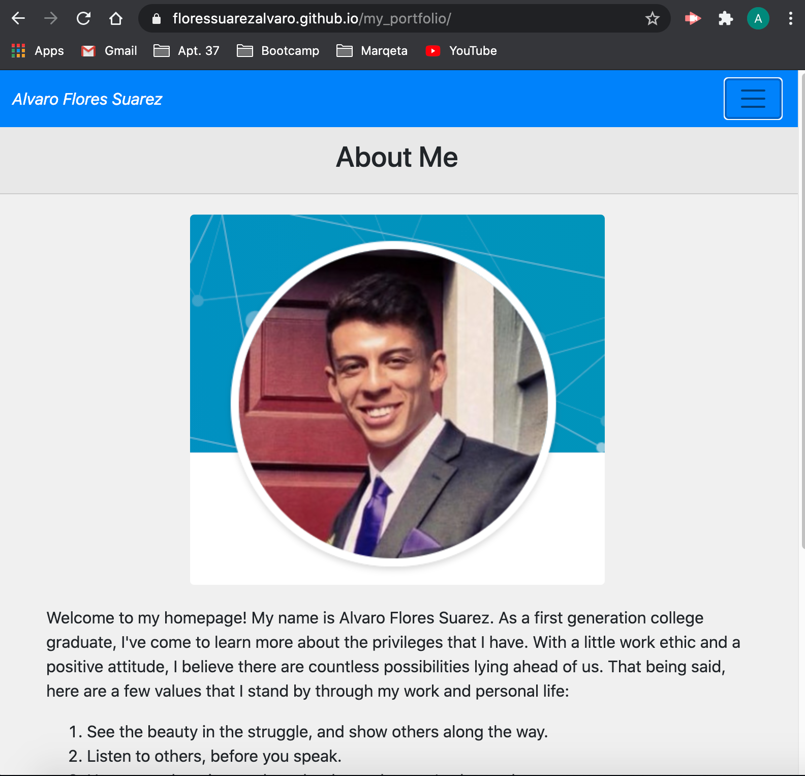
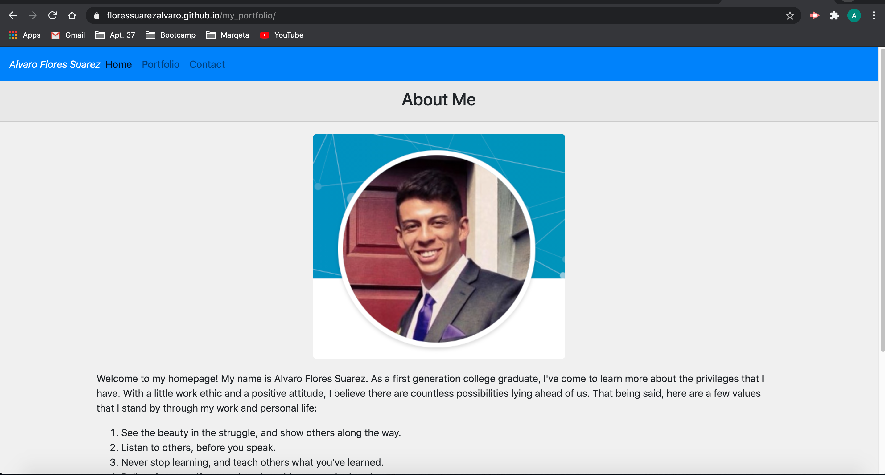

# Alvaro's Portfolio

## The Repository

This repository provides the landing page for my portfolio. In my portfolio I provide a brief description of who I am, and I intend to continuously post my projects and work.

Please click the link below to open the [My Portfolio](https://floressuarezalvaro.github.io/my_portfolio/). Since my page is responsive, I'll include two screenshots of my page for visibility. The first screenshot displays what it should look like on a small device such as your mobile device, and the second screenshot displays what it should look like on your larger screen.

## Contributing

The best way to participate in my portfolio is to [submit a bug](https://github.com/floressuarezalvaro/portfolio/issues). Additionally, you can review the [source code](https://github.com/floressuarezalvaro/portfolio/pulls) changes. Lastly, you can [build from the source itself](https://github.com/floressuarezalvaro/portfolio/wiki).

## Credits

I used Bootstrap throughout my porfolio. Please click [here](https://getbootstrap.com/) to visit the Bootstrap page. Here you'll find the same documentation I used to build my pages out.

## MIT License

Copyright (c) [2020] [Alvaro Flores Suarez]

Permission is hereby granted, free of charge, to any person obtaining a copy
of this software and associated documentation files (the "Software"), to deal
in the Software without restriction, including without limitation the rights
to use, copy, modify, merge, publish, distribute, sublicense, and/or sell
copies of the Software, and to permit persons to whom the Software is
furnished to do so, subject to the following conditions:

The above copyright notice and this permission notice shall be included in all
copies or substantial portions of the Software.

THE SOFTWARE IS PROVIDED "AS IS", WITHOUT WARRANTY OF ANY KIND, EXPRESS OR
IMPLIED, INCLUDING BUT NOT LIMITED TO THE WARRANTIES OF MERCHANTABILITY,
FITNESS FOR A PARTICULAR PURPOSE AND NONINFRINGEMENT. IN NO EVENT SHALL THE
AUTHORS OR COPYRIGHT HOLDERS BE LIABLE FOR ANY CLAIM, DAMAGES OR OTHER
LIABILITY, WHETHER IN AN ACTION OF CONTRACT, TORT OR OTHERWISE, ARISING FROM,
OUT OF OR IN CONNECTION WITH THE SOFTWARE OR THE USE OR OTHER DEALINGS IN THE
SOFTWARE.